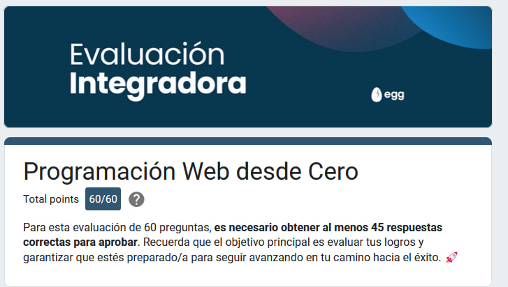

# Egg

## Libros y guias
Desarrollados dentro del curso programación web desde cero de Egg

## Estrellas

## Colaboradores

## Mi puntuación

## Descargo de responsabilidad

El contenido de este curso de programación no es de mi autoría y ha sido desarrollado por terceros. Aunque se han tomado todas las medidas necesarias para garantizar la confiabilidad y precisión de la información proporcionada en este curso, no puedo garantizar la exactitud, integridad, actualidad, adecuación o validez de la información proporcionada.

Este repositorio ha sido creado únicamente con fines educativos y no debe ser considerado como asesoría profesional o consejo individualizado. Se recomienda a los usuarios que busquen asesoramiento profesional o consulten fuentes adicionales antes de tomar decisiones basadas en la información proporcionada en este curso.